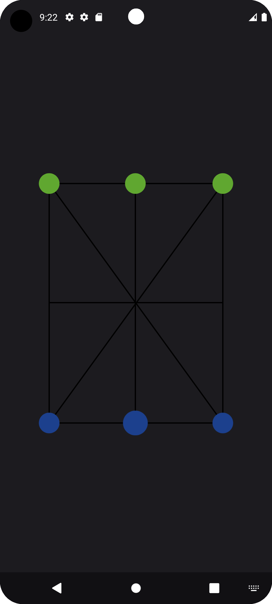
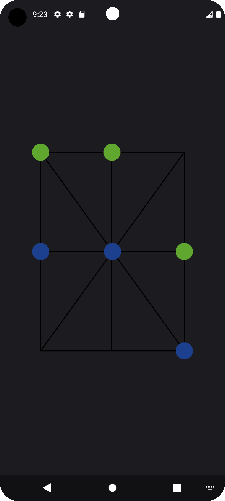
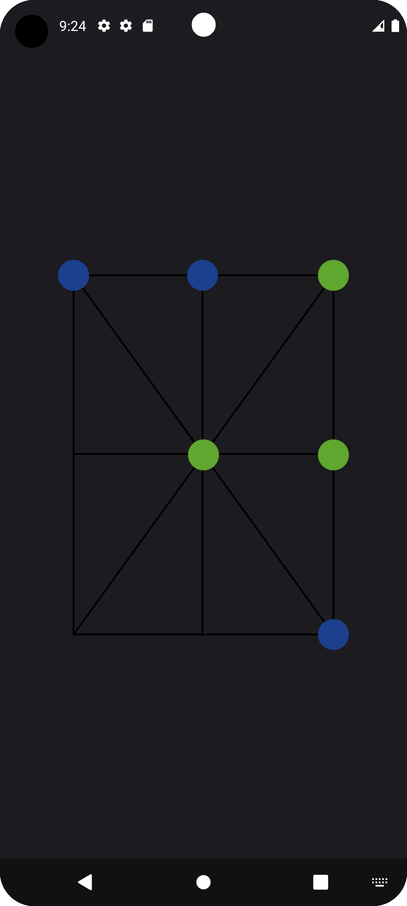

# DamaOfThree

Dama of Three is a game of checkers in a sense and Tic tac toe in other sense.
It is so old so has many names around the world like "Three Men's Morris", "Nine Holes", "Tria", "Terni Lapilli"...

🎯 Objective:

Get three of your pieces in a straight line (horizontal, vertical, or diagonal) — similar to tic-tac-toe — but with the ability to move after all pieces are placed.

🪑 Game Setup:

  Board: Choose between empty or full board.

  Players: 2
    Can be Ai or a friend.
    
📏 Rules:

1. Placing Phase:

    Players take turns placing one piece at a time on any empty spot on the 3x3 grid.

    Goal: Try to make a line or prevent your opponent from doing so.

2. Moving Phase:

    Once all six pieces are on the board (3 per player), players take turns moving one piece to an adjacent empty spot (orthogonally or diagonally).

    No jumping like in checkers. Just one step at a time.

    Winning: Form a straight line of your 3 pieces at any time.

📱 Screenshots:

